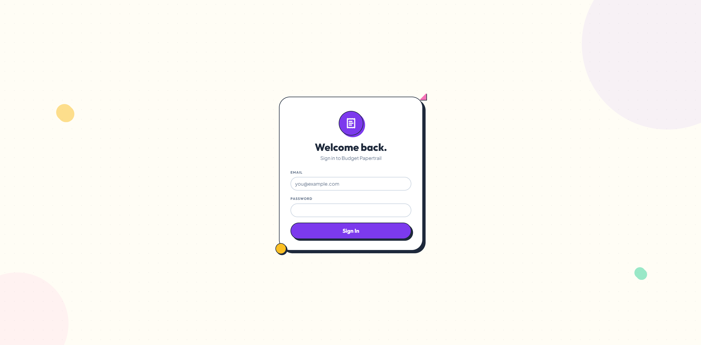
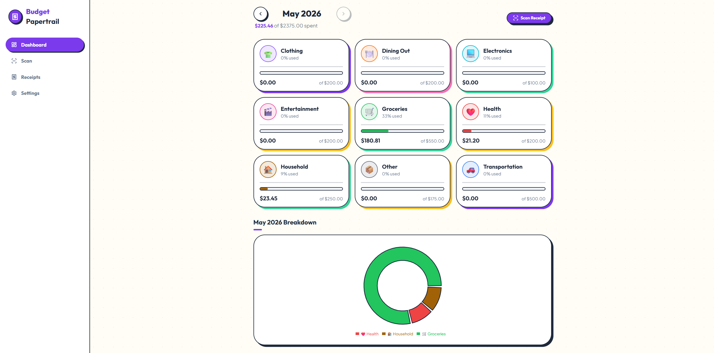
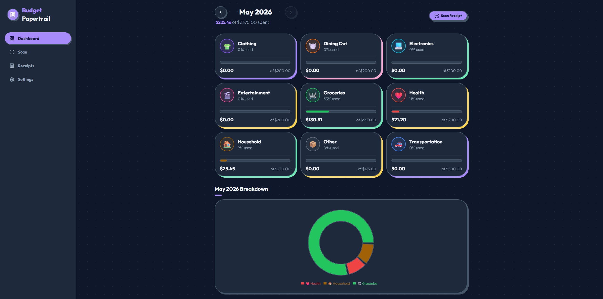
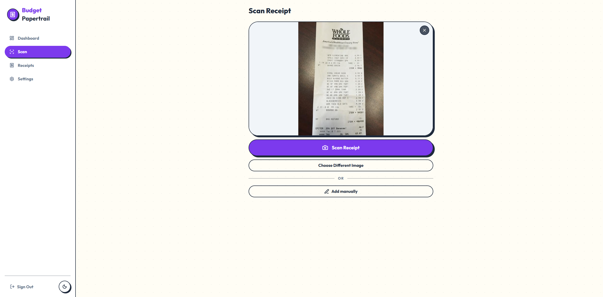
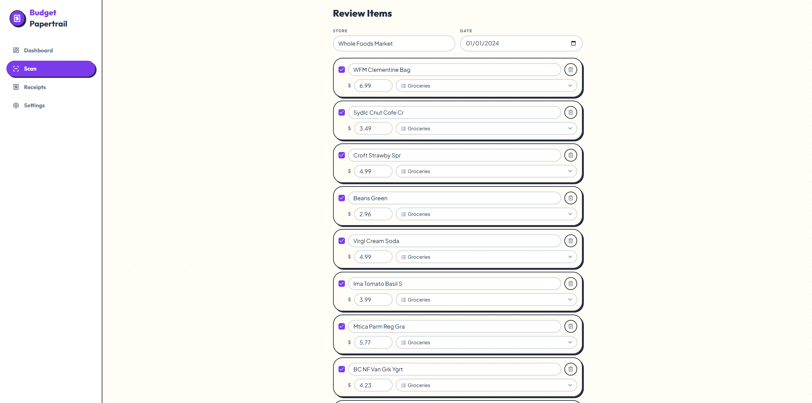
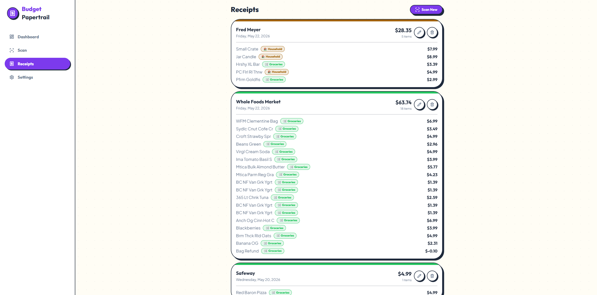
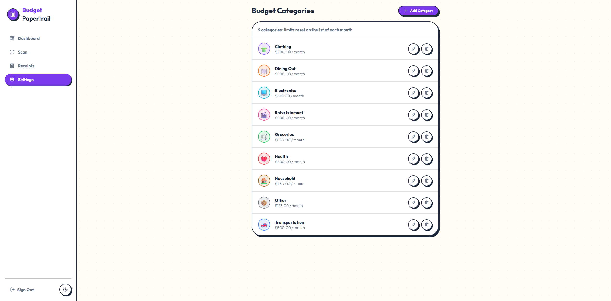

# Budget Papertrail

A budgeting app that uses AI to read and categorize store receipts. Photograph a receipt, review the AI-parsed line items, assign categories, and watch your monthly budget update in real time.

**Live:** https://budget-papertrail.vercel.app

---

## UI

<p align="center">
  
</p>

<p align="center">
  
</p>

<p align="center">
  
</p>

<p align="center">
  
</p>

<p align="center">
  
</p>

<p align="center">
  
</p>

<p align="center">
  
</p>

---

## Features

- 📸 **Receipt scanning** — take a photo directly from your phone or upload from desktop
- 🤖 **Claude Vision AI** — reads every line item and suggests a budget category automatically
- ✏️ **Review before saving** — edit item names, prices, and categories before anything hits your budget
- 📊 **Monthly dashboard** — progress bars per category with green/amber/red status, donut chart breakdown, and ← → month navigation
- 📈 **6-month spending history** — stacked bar chart showing trends across the last 6 months
- 🗂️ **Receipt history** — view, edit, or delete past receipts with full line-item detail
- ⚙️ **Custom categories** — create your own categories with custom icons, colors, and monthly limits
- 🌙 **Dark mode** — follows system preference, togglable manually
- 📱 **PWA** — installable to your phone home screen, camera works natively on mobile

---

## Stack

| Layer | Choice |
|---|---|
| Framework | Next.js 16 (App Router) |
| Styling | Tailwind CSS v4 + shadcn/ui v4 |
| Database + Auth | Supabase (PostgreSQL + Row Level Security) |
| File Storage | Supabase Storage |
| Receipt OCR | Claude Vision API (`claude-sonnet-4-6`) |
| Charts | Recharts |
| Fonts | Outfit + Plus Jakarta Sans |
| Hosting | Vercel |

---

## Local Development

### 1. Clone and install

```bash
git clone https://github.com/SeanClay10/budget-papertrail.git
cd budget-papertrail
npm install
```

### 2. Set up Supabase

1. Create a project at [supabase.com](https://supabase.com)
2. Run `supabase-setup.sql` in the Supabase **SQL Editor**
3. Run `supabase-billing-migration.sql` in the Supabase **SQL Editor** (adds the `user_profiles` table)
4. Go to **Authentication → Providers → Email** → enable Email provider, **enable Sign Ups**, enable Confirm Email
5. Go to **Authentication → URL Configuration** → set Site URL to your app URL, add `http://localhost:3000/auth/callback` to Redirect URLs

### 3. Set up Stripe

1. Create an account at [stripe.com](https://stripe.com)
2. Create a **Product** named "Budget Papertrail Pro"
3. Add a **Price**: $5.00 / month recurring → copy the `price_...` ID
4. Create a **Webhook** endpoint at `https://your-app.vercel.app/api/stripe/webhook`
   - Events: `checkout.session.completed`, `customer.subscription.updated`, `customer.subscription.deleted`, `invoice.payment_failed`
5. Configure the **Customer Portal** at [billing.stripe.com/p/login/...](https://dashboard.stripe.com/test/settings/billing/portal) so subscribers can manage/cancel

### 4. Environment variables

Create `.env.local` in the project root:

```env
NEXT_PUBLIC_SUPABASE_URL=https://your-project.supabase.co
NEXT_PUBLIC_SUPABASE_ANON_KEY=your_anon_key
SUPABASE_SERVICE_ROLE_KEY=your_service_role_key
ANTHROPIC_API_KEY=your_anthropic_api_key

STRIPE_SECRET_KEY=sk_live_...
STRIPE_WEBHOOK_SECRET=whsec_...
STRIPE_PRICE_ID=price_...
NEXT_PUBLIC_APP_URL=http://localhost:3000
```

### 5. Run

```bash
npm run dev
```

Open [http://localhost:3000](http://localhost:3000). New users can sign up at `/signup`.

---

## Deployment

Hosted on Vercel — every push to `master` triggers an automatic redeployment.

To deploy your own instance:
1. Import the repo at [vercel.com](https://vercel.com)
2. Add all environment variables in the Vercel dashboard (set `NEXT_PUBLIC_APP_URL` to your Vercel URL)
3. Add your Vercel URL to Supabase's redirect allowlist: `https://your-app.vercel.app/auth/callback`

---

## Access & Billing

New users sign up at `/signup` with email and password. A confirmation email is sent before they can log in.

**Free plan**: 10 lifetime receipt scans (AI-powered). Manual entry is always unlimited.

**Pro plan**: $5/month via Stripe for unlimited scans. Users upgrade from the Scan page or Settings → Billing.

Existing accounts created before this feature launched are grandfathered as unlimited.

---

## Database Schema

| Table | Purpose |
|---|---|
| `user_profiles` | Per-user scan count, subscription status, and Stripe IDs |
| `budget_categories` | User-defined categories with monthly limits |
| `receipts` | One row per scanned receipt |
| `receipt_items` | Line items linked to receipts and categories |

All tables have Row Level Security enabled — users can only access their own data.
